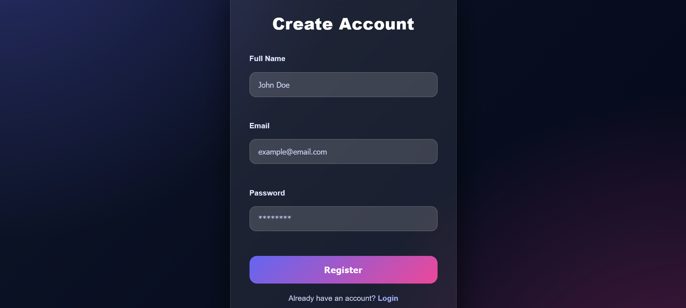
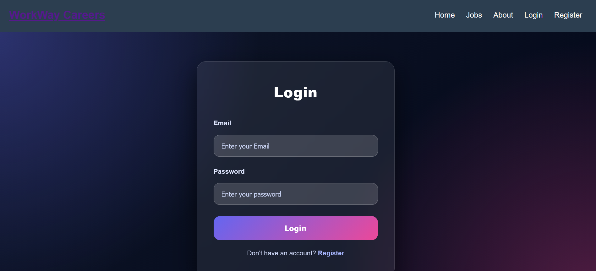
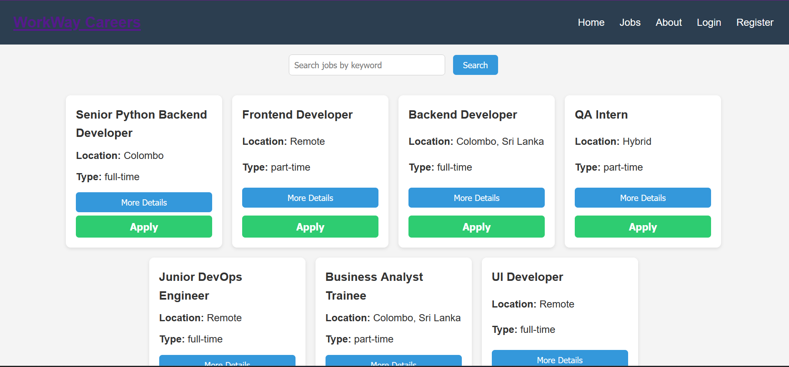
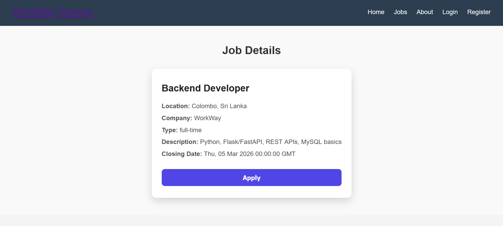
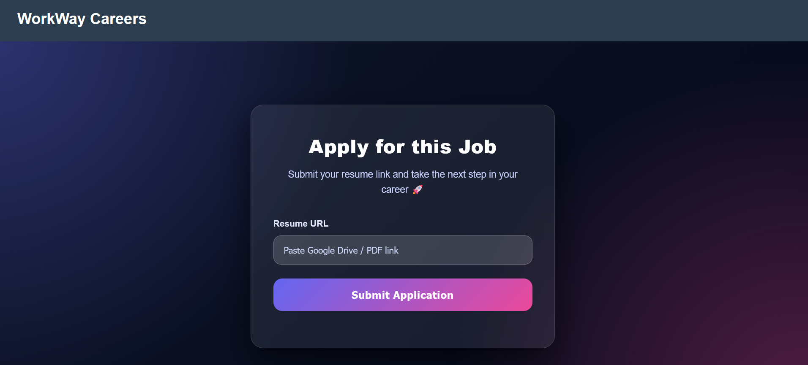

# WorkWay Job Portal (Full-Stack Web Application)

##  Overview
WorkWay is a full-stack **Job Portal web application** built using a clean **3-tier architecture**:

- **Frontend (Presentation Layer)**  
- **Backend REST API (Application Layer)**  
- **MySQL Database (Data Layer)**  

This project is fully **containerized using Docker** and managed with **Docker Compose**, allowing the entire system (frontend + backend + database) to run with a single command.

---

##  Architecture (3-Tier)

### 1)  Frontend (Presentation Layer)
- Built with **HTML / CSS / JavaScript**
- User interface for registration, login, job browsing, search, and job applications
- Admin UI pages included and expanded in later versions

### 2)  Backend API (Application Layer)
- Python-based REST API
- Clean layered structure:
  - **Routes** → API endpoints
  - **Services** → business logic
  - **Models** → database queries
- Designed for scalability and maintainability

### 3)  Database (Data Layer)
- **MySQL**
- Runs inside Docker
- Managed using **Adminer** for database access

---

##  Features

###  User (Job Seeker)
- Register & Login
- View job listings
- View detailed job descriptions
- Search jobs (keyword/category/location)
- Apply for jobs

###  Admin (Planned / Next Version)
- Admin login
- Create job listings
- Update job listings
- Delete job listings
- View job applications

> The current repository version focuses on completing the User-side flow first.  
> Admin features will be added as the next development milestone.

---

##  Docker & Containerization

This project uses **Docker + Docker Compose** to run all services as containers:

- Frontend container
- Backend API container
- MySQL database container
- Adminer container (database GUI)

### Why Docker?
- No need to install MySQL locally
- Runs the same on any machine (portable environment)
- Easy setup for testing, development, and interviews
- Demonstrates real-world deployment practices

---

##  How to Run

### 1) Requirements
- Docker installed
- Docker Compose installed (usually included with Docker Desktop)

### 2) Run the system
```bash
docker compose up --build
```

### 3) Tech Stack
- Frontend: HTML, CSS, JavaScript
- Backend: Python (Flask/REST API)
- DB: MySQL
- Tools: Docker, Docker Compose, Adminer

---

## Access URLs
- Frontend: http://localhost:3000
- Backend API: http://localhost:5001
- Adminer: http://localhost:8080


---
## Screenshots

#### Register Page


#### Login Page


#### Home Page


#### Job-details Page


#### Job Apply Page


---

## Notes 
- .env is excluded using .gitignore
- Database is accessed using Adminer for easy testing
- The system is structured for future enhancements (Admin panel, user profile, validations, etc.)

---

## Future Improvements
- Full Admin Panel completion
- View applications list in Admin
- User profile management
- Save jobs / favorites
- UI/UX improvements
- Form validations and better error handling

--- 

## Credits 
- Project developed by Hansi Savindi.
- Inspired by Job posting web page workflows and designed for educational purposes.